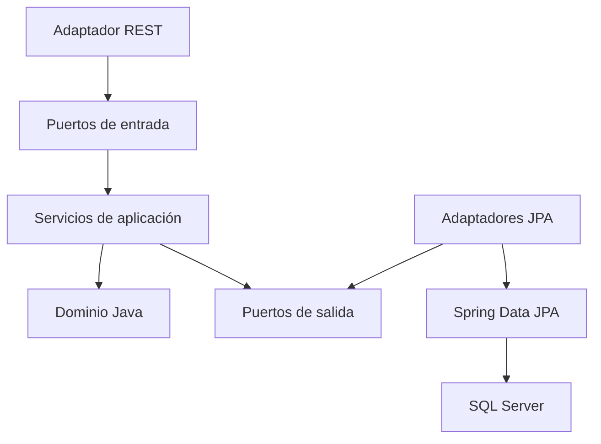

# Arquitectura hexagonal del backend

## Dirección de dependencias



La composición se realiza en `BeanConfiguration`. Los servicios de aplicación
se construyen como objetos Java normales y reciben interfaces de salida. Esto
evita que los controladores conozcan repositorios JPA.

## Paquetes

```text
com.universidad.redes
├── domain
│   ├── model
│   └── exception
├── application
│   ├── port
│   │   ├── in
│   │   └── out
│   └── service
└── infrastructure
    ├── adapter
    │   ├── in/rest
    │   └── out/persistence
    └── configuration
```

## Responsabilidades

| Zona | Responsabilidad | Dependencias permitidas |
|---|---|---|
| `domain` | Reglas y modelos de redes | Solo Java |
| `application/port/in` | Operaciones ofrecidas por la aplicación | Dominio |
| `application/service` | Casos de uso y errores de recurso | Dominio y puertos |
| `application/port/out` | Contratos de consulta | Dominio |
| `adapter/in/rest` | HTTP, validación de entrada y DTOs JSON | Puertos de entrada |
| `adapter/out/persistence` | JPA, entidades y mapeo SQL Server | Puertos de salida |
| `configuration` | Ensamblaje de dependencias y CORS | Spring e interfaces |

## Flujo de una consulta

Para `GET /api/ports/443`:

1. `NetworkPortController` recibe y valida el número.
2. El controlador llama a `GetPortsUseCase`.
3. `NetworkPortService` ejecuta el caso de uso.
4. El servicio solicita datos mediante `NetworkPortRepositoryPort`.
5. `NetworkPortPersistenceAdapter` consulta Spring Data JPA.
6. JPA usa JDBC y el driver de Microsoft para consultar SQL Server.
7. El adaptador convierte la entidad JPA en un modelo del dominio.
8. El controlador convierte el dominio en `NetworkPortResponse`.
9. Spring serializa la respuesta como JSON.

## Decisiones relevantes

- El dominio no importa clases de Spring, Jakarta Persistence, HTTP ni SQL.
- Hibernate usa `ddl-auto=validate`: nunca crea ni altera las tablas.
- Los scripts de `redes-database` son la fuente única del esquema.
- `NETWORK_PORT` obtiene el transporte y la capa OSI mediante su protocolo.
- Los `EntityGraph` cargan las relaciones necesarias con la sesión activa y
  permiten mantener `spring.jpa.open-in-view=false`.
- `DevelopmentFlowService` no necesita una tabla: describe la arquitectura
  estable de la propia aplicación mediante un caso de uso.
- El pool JDBC está limitado a cinco conexiones porque el alcance académico es
  pequeño y de solo lectura.
